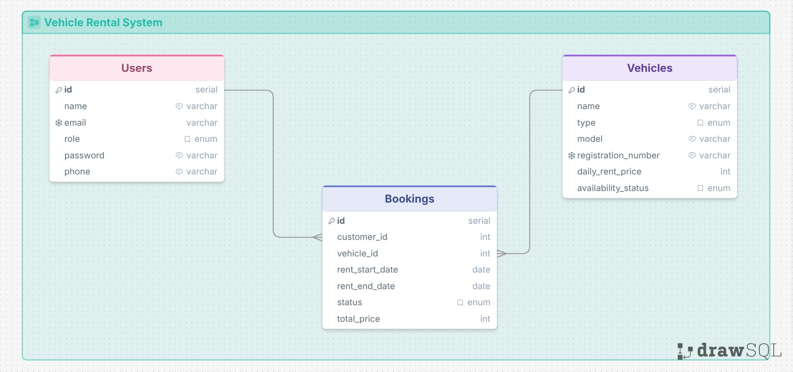

# 🚐 Rent Vehicle System Database

A robust, role based vehicle rental system is designed around a centralized Relational Database Management System (RDBMS) utilizing a decoupled, modular three-tier entity structure. This architecture establishes reliable data integrity patterns, transactional boundaries, and operational auditing workflows for user management, vehicle asset tracking, and booking fulfillment.

## **🗺️ Entity Relationship Diagram:**



---

## 🌟 Database Schema Design (DDL)

The schema utilizes custom constraints, explicit relational foreign keys, and default states to enforce business logic integrity. Primary and foreign keys match the Entity-Relationship Diagram (ERD) structure.

---

## 🛠️ Technology Stack

Here the database is created using postgreSQL. Which is much more efficient in handling different types and suitable for future scalability of the system.

---

## ⚙️ Local Setup Instructions

Follow these steps to get your local environment configured and running the database smoothly :

**1. Install postgreSQL**

Install suitable postgreSQL server based on your machine spec .

**2. Create a user**
After installing create a root user and set password along with that you will get a new app pgAdmin 4. But we recommend using beekeeper download and install it based on you machine.

**3. Connecting and Create Database**
After successfully installing give your root user username and password and create a database. After selecting the created database past this following sql code for creating table.

```sql
CREATE TABLE IF NOT EXISTS users(
	user_id SERIAL PRIMARY KEY,
	name VARCHAR(200) NOT NULL,
	email VARCHAR(200) UNIQUE NOT NULL,
	phone VARCHAR(20) NOT NULL,
	role VARCHAR(200) NOT NULL DEFAULT 'Customer',

	CONSTRAINT check_role CHECK(role IN ('Admin','Customer'))
);

CREATE TABLE IF NOT EXISTS vehicles(
	vehicle_id SERIAL PRIMARY KEY,
	name VARCHAR(200) NOT NULL,
	type VARCHAR(200) NOT NULL,
	model VARCHAR(100) NOT NULL,
 	registration_number VARCHAR(200) UNIQUE NOT NULL,
	rental_price INT NOT NULL,
	status VARCHAR(20) NOT NULL DEFAULT 'available',

	CONSTRAINT check_price CHECK(rental_price>=0),
	CONSTRAINT check_type CHECK(type IN ('car', 'bike', 'truck','van', 'SUV')),
	CONSTRAINT check_availability CHECK(status IN ('available', 'rented', 'maintenance'))
);

CREATE TABLE IF NOT EXISTS bookings (
	booking_id SERIAL PRIMARY KEY,
	user_id INT NOT NULL REFERENCES users(user_id),
	vehicle_id INT NOT NULL REFERENCES vehicles(vehicle_id),
	start_date DATE NOT NULL,
	end_date DATE NOT NULL,
	status VARCHAR(20) NOT NULL DEFAULT 'pending',
	total_cost INT NOT NULL,

	CONSTRAINT check_rent_dates CHECK (end_date >= start_date),
	CONSTRAINT check_total_price CHECK (total_cost >= 0),
	CONSTRAINT check_status CHECK (status IN ('completed', 'confirmed', 'pending', 'returned'))
);
```

**4.Run the query**
After pasting run the whole script or select the pasted portion and then run the portion
**5.Input in the table**
For inserting the values in the table. past this following sql query codes and then run.

```sql
-- Inserting data
INSERT INTO users (name, email, phone, role) VALUES
('Alice', 'alice@example.com', '1234567890', 'Customer'),
('Bob', 'bob@example.com', '0987654321', 'Admin'),
('Charlie', 'charlie@example.com', '1122334455', 'Customer');

INSERT INTO vehicles (name, type, model, registration_number, rental_price, status) VALUES
('Toyota Corolla', 'car', '2022', 'ABC-123', 50, 'available'),
('Honda Civic', 'car', '2021', 'DEF-456', 60, 'rented'),
('Yamaha R15', 'bike', '2023', 'GHI-789', 30, 'available'),
('Ford F-150', 'truck', '2020', 'JKL-012', 100, 'maintenance');

INSERT INTO bookings (user_id, vehicle_id, start_date, end_date, status, total_cost) VALUES
(1, 2, '2023-10-01', '2023-10-05', 'completed', 240),
(1, 2, '2023-11-01', '2023-11-03', 'completed', 120),
(3, 2, '2023-12-01', '2023-12-02', 'confirmed', 60),
(1, 1, '2023-12-10', '2023-12-12', 'pending', 100);
```

**6. Run Queries**
For running queries on the created tables and checking the results here are some intuitive complex queries are given in the link. Copy this queries and run one by one and see the result.
[for queries click here!](https://github.com/Apurbo7t3/Vehicle-Rental-System-Database/blob/main/queries.sql)

## 📄 License

This project is open-source software licensed under the ISC License.
